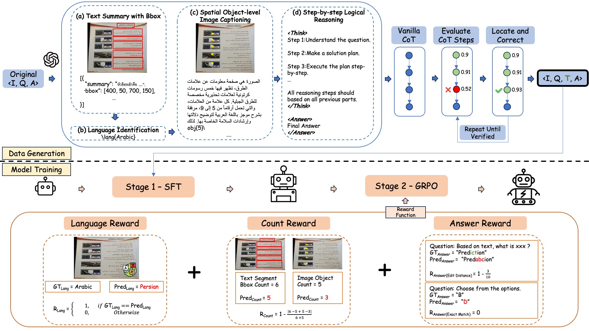

<h1 align="center">
	LaV-CoT: Language-Aware Visual CoT with Multi-Aspect Reward
Optimization for Multilingual Text-Centric VQA
</h1>

<div align="center">


</div>

# Table of Contents

- [Table of Contents](#table-of-contents)
- [Prompt](#prompt)
- [Data](#data)
- [Language-aware Multi-aspect Rewards](#language-aware-multi-aspect-rewards)
- [Training Methods](#training-methods)
- [Citation](#citation)

# Prompt
Please check `./prompts` for both generator and evaluator prompts.

# Data
We design an automatic data curation method that produces scalable, high-quality multilingual CoT annotations through iterative generation, correction, and refinement. All images are resized to 896 * 896.

# Language-aware Multi-aspect Rewards
1. Language Reward
2. Count Reward
3. Answer Reward
4. Format Reward

# Training Methods
We adopt TRL offical training scripts (https://github.com/huggingface/trl) to do both SFT and GRPO training.

# Citation  

```bibtex
@misc{huang2025lavcotlanguageawarevisualcot,
      title={LaV-CoT: Language-Aware Visual CoT with Multi-Aspect Reward Optimization for Real-World Multilingual VQA}, 
      author={Jing Huang and Zhiya Tan and Shutao Gong and Fanwei Zeng and Joey Tianyi Zhou and Changtao Miao and Huazhe Tan and Weibin Yao and Jianshu Li},
      year={2025},
      eprint={2509.10026},
      archivePrefix={arXiv},
      primaryClass={cs.CV},
      url={https://arxiv.org/abs/2509.10026}, 
}
```